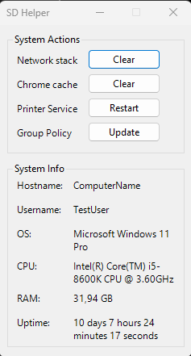

# Overview

<table>
  <tr>
      <td>
      
    </td>
    <td>
      
Small GUI tool for PowerShell, designed to streamline the execution of routine maintenance commands on client computers. Although as a proof of concept project, this tool encapsulates frequently used commands into a user-friendly interface, enhancing administrative tasks and troubleshooting processes.

      
It's most effective for quick, routine tasks that the client can handle themselves and may not substitute comprehensive remote management solutions.

    </td>
  </tr>
</table>

# Features

The SD GUI Tool offers a set of predefined commands for quick and efficient system maintenance:

- <b>Clear Network Stack</b>: Resets the network configurations to resolve connectivity issues.
- <b>Clear Chrome Cache</b>: Purges the cache of Google Chrome to free up space and potentially address performance problems.
- <b>Restart Printer Service</b>: Restarts the printer service to resolve common printing issues.
- <b>Update Group Policy</b>: Refreshes the group policy settings to ensure the latest configurations are applied.
- Additionally, the tool displays the hostname and username of the current user for easy identification.

# Installation and Usage

## Prerequisites

Requires PowerShell and can be ran as any regular PowerShell-script:
`.\SD_GUI_tool.ps1`

## Running the tool

1. Download the SD_GUI_tool.ps1 script to your local machine.
2. Open PowerShell with the necessary administrative privileges.
3. Navigate to the directory containing the downloaded script.
4. Execute the script by entering the following command:
   `.\SD_GUI_tool.ps1`
5. The GUI should appear, presenting the available commands and system information.
